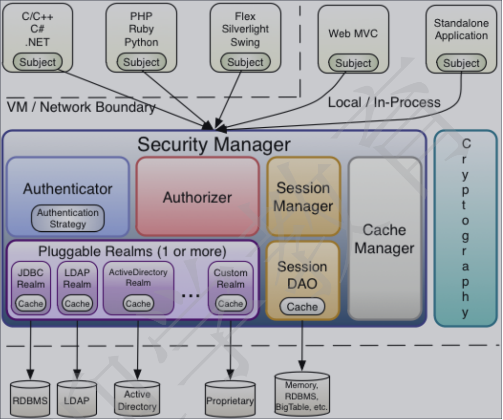
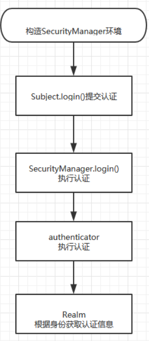

# 数据库监控
localhost:port/druid/sql.html
# swagger UI 的地址格式 
http://host:port/swagger-ui.html

subject：主体，可以是用户也可以是程序，主体要访问系统，系统需要对主体进行认证、授权。
security Manager：安全管理器，主体进行认证和授权都是通过securityManager进行。
authenticator：认证器，主体进行认证最终通过authenticator进行的。
authorizer：授权器，主体进行授权最终通过authorizer进行的。
sessionManager：web应用中一般是用web容器对session进行管理，shiro也提供一套session管理的方式。
SessionDao： 通过SessionDao管理session数据，针对个性化的session数据存储需要使用sessionDao。
cache Manager：缓存管理器，主要对session和授权数据进行缓存，比如将授权数据通过cacheManager进行缓存管理，和
ehcache整合对缓存数据进行管理。
Cryptography：加密，保护数据的安全性，如密码加密存储到数据库，而不是明文存储。
realm：域，领域，相当于数据源，通过realm存取认证、授权相关数据。
记住一点，Shiro 不会去维护用户、维护权限；这些需要我们自己去设计/提供；然后通过相应的接口注入给Shiro 即可。

认证：
1. 构建SecurityManager环境
2. 主体提交认证
3. SecurityManager 处理
4. 流转到 Authenticator 执行认证
5. 通过 Realm 获取相关的用户信息（获取验证数据进行验证）
授权：
1. 创建构建SecurityManager环境
2. 主体提交授权认证
3. SecurityManager 处理
4. 流转到 Authorizor 授权器执行授权认证
5. 通过 Realm 从数据库或配置文件获取角色权限数据返回给授权器，进行授权

